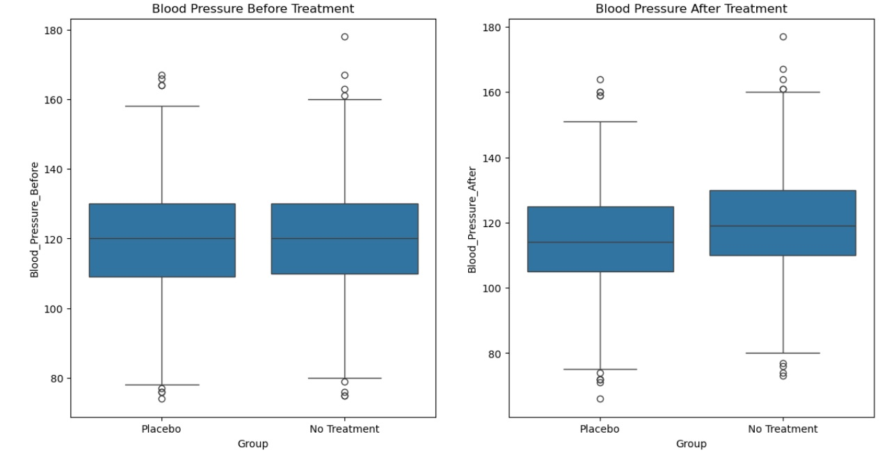
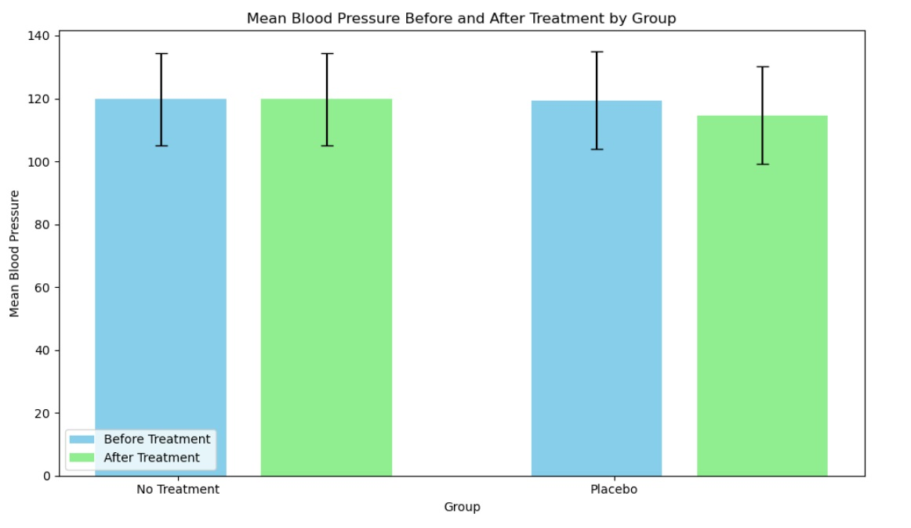

# Placebo Analyse

## Ziel
Dieses Repository enthält eine Analyse von Blutdruckdaten aus zwei Gruppen: einer Placebo-Gruppe und einer Gruppe ohne Behandlung. Das Ziel ist es, die Auswirkungen der Placebo-Behandlung im Vergleich zur Nichtbehandlung auf die Blutdruckwerte zu untersuchen.

## Schritte der Analyse
### 1. Deskriptive Analyse
Berechnung des Mittelwerts und der Standardabweichung des Blutdrucks vor und nach der Behandlung für beide Gruppen.
Visualisierung der Daten mit Boxplots zur Untersuchung der Verteilung der Blutdruckwerte.

### 2. Statistischer Test
Durchführung eines gepaarten t-Tests, um die Mittelwerte des Blutdrucks vor und nach der Behandlung innerhalb jeder Gruppe zu vergleichen.

## Schlussfolgerung
Diese Analyse bietet Einblicke in die Auswirkungen der Placebo-Behandlung im Vergleich zur Nichtbehandlung auf die Blutdruckwerte. Die Ergebnisse zeigen einen signifikanten Placebo-Effekt auf die Reduktion des Blutdrucks.
